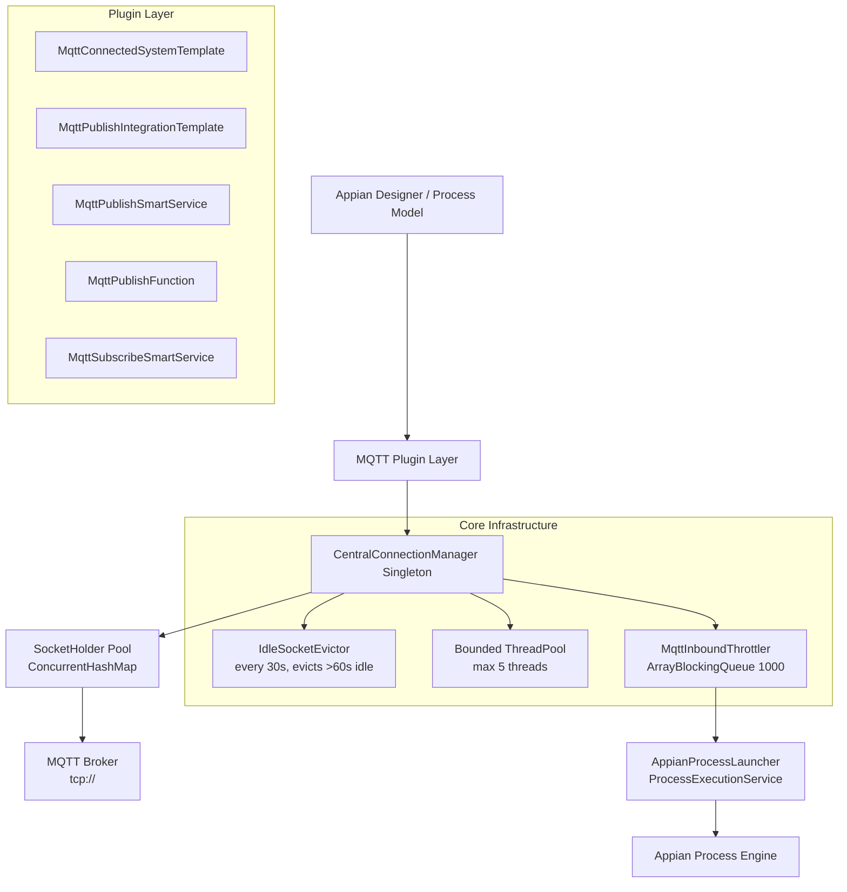

# Implementation Plan - Appian MQTT/IoT Connected System Plug-in

## Problem Statement

Appian lacks native support for lightweight IoT and socket-based protocols (MQTT, AMQP, CoAP, and WebSockets). Enterprise developers currently deploy intermediate translation infrastructure—such as AWS IoT Core, AWS Lambda, or Node-RED—solely to convert inbound MQTT streams into Appian HTTP WebAPI calls. This plug-in provides native MQTT 3.1.1 connectivity directly within Appian's low-code platform.

## Requirements

1. **MQTT Protocol**: Target MQTT 3.1.1 exclusively using Eclipse Paho v3 client
2. **Authentication**: Basic auth (tcp:// + username/password) — no TLS/SSL in initial phase
3. **Outbound Publishing**: Via Connected System + Integration Template, Smart Service, and Expression Function
4. **Inbound Subscription**: Both persistent background listener and one-shot mode
   - Persistent listener: configurable throttle, connection pool limit, queue-based message processing, leak-free
   - One-shot: subscribe, collect messages up to timeout/count, return
5. **Process Triggering**: Inbound events trigger Appian process models directly via `ProcessExecutionService`
6. **JVM Safety**: Bounded thread pools, idle socket eviction, `AutoCloseable` patterns, `ArrayBlockingQueue` buffering
7. **Packaging**: Remove HelloWorld examples, ship only MQTT functionality; use `maven-shade-plugin` to bundle Paho/Jackson
8. **Extension Points**: Connected System template, Integration template, Smart Service, and Expression Function

## Background (Current Codebase State)

- **pom.xml**: Already configured with Paho MQTT 1.2.5, Jackson 2.17.0, maven-shade-plugin, JUnit 5, Java 17
- **SocketHolder.java**: Implemented — wraps `MqttAsyncClient` with `lastAccessedTimestamp` tracking and `AutoCloseable`
- **appian-plugin.xml**: Currently only registers HelloWorld examples (to be replaced)
- **No test directory** exists yet (`src/test/` needs to be created)
- **HelloWorld examples**: To be removed entirely

## Proposed Solution

A hybrid extension layer providing:
- **MqttConnectedSystemTemplate** — broker connection configuration (url, clientId, username, password, keepAlive, cleanSession)
- **MqttPublishIntegrationTemplate** — low-code publish from Integration Designer
- **MqttPublishSmartService** — publish from Process Models
- **MqttPublishFunction** — `mqttPublish()` expression function for SAIL
- **MqttSubscribeSmartService** — one-shot subscribe (wait for messages/timeout) OR persistent background listener that triggers processes
- **CentralConnectionManager** — singleton managing pooled connections with idle eviction
- **MqttInboundThrottler** — `ArrayBlockingQueue`-based message buffer with configurable rate limiting and JSON filter criteria

## Architecture Diagram



## Task Breakdown

---

### Task 1: Project Cleanup & Test Infrastructure Setup

**Objective:** Remove HelloWorld scaffold code, establish test directory structure, and verify the build compiles cleanly with only the existing `SocketHolder` class.

**Implementation Guidance:**
- Delete `src/main/java/com/example/appian/functions/HelloWorldFunction.java`
- Delete `src/main/java/com/example/appian/smartservices/HelloWorldSmartService.java`
- Delete the now-empty `functions/` and `smartservices/` directories
- Update `appian-plugin.xml`: remove `<function>` and `<smart-service>` entries for HelloWorld, remove the `<function-category>` entry; keep just the `<appian-plugin>` wrapper and `<plugin-info>`
- Create `src/test/java/com/example/appian/mqtt/core/` directory structure
- Create a basic `SocketHolderTest.java` that verifies the `SocketHolder` constructor, `touch()` updates the timestamp, and `getConnectionKey()` returns the expected value (no broker connection needed — mock the `MqttAsyncClient`)
- Run `./mvnw clean compile` and `./mvnw test` to verify green build

**Test Requirements:**
- `SocketHolderTest`: verify construction, timestamp tracking, `isConnected()` delegation to mock client, `close()` calls disconnect+close on the mock

**Demo:** Clean project compiles with only MQTT code. Unit test passes for `SocketHolder`.

---

### Task 2: CentralConnectionManager Singleton with Idle Socket Eviction

**Objective:** Implement the JVM-wide singleton that manages pooled MQTT connections, caps thread usage, and evicts idle sockets.

**Implementation Guidance:**
- Create `src/main/java/com/example/appian/mqtt/core/CentralConnectionManager.java`
- Private constructor, static instance holder pattern (thread-safe lazy initialization)
- Internal state: `ConcurrentHashMap<String, SocketHolder>` for connection registry
- Bounded `ScheduledExecutorService` (max 5 worker threads) — configurable via constant
- `getOrConnect(brokerUrl, clientId, username, password, connectionTimeout, cleanSession)`:
  - Compute `connectionKey = brokerUrl + "::" + clientId`
  - If key exists and client is connected, `touch()` and return the `SocketHolder`
  - Otherwise, create new `MqttAsyncClient` with `MemoryPersistence`, set `MqttConnectOptions` (username/password, cleanSession, connectionTimeout, automaticReconnect=true, maxInflight=10), connect, wrap in `SocketHolder`, store in map
- `releaseConnection(connectionKey)`: remove from map and call `SocketHolder.close()`
- `shutdown()`: iterate all entries, close each, clear map, shutdown executor
- Inner class or private method `IdleSocketEvictor` scheduled at fixed rate (every 30s): iterates map, any `SocketHolder` with `lastAccessedTimestamp` older than 60,000ms gets closed and removed
- Start the evictor in a static initializer or on first `getInstance()` call
- Configurable constants: `MAX_WORKER_THREADS=5`, `EVICTION_INTERVAL_MS=30000`, `IDLE_TIMEOUT_MS=60000`, `MAX_CONNECTIONS=20` (pool cap)

**Test Requirements:**
- `CentralConnectionManagerTest`:
  - Test singleton instance is same reference
  - Test `getOrConnect` creates new connection (mock Paho client via a test helper or use Mockito)
  - Test reuse: calling `getOrConnect` twice with same key returns same holder
  - Test idle eviction: set a holder's timestamp to past, invoke evictor logic, verify removal
  - Test `shutdown()` clears all connections
  - Test pool cap: attempting to exceed `MAX_CONNECTIONS` returns an error/exception

**Demo:** Singleton creates, pools, and evicts MQTT connections. All unit tests pass.

---

### Task 3: MqttConnectedSystemTemplate (Broker Configuration UI)

**Objective:** Implement the Connected System template that Appian Designer uses to configure broker connections.

**Implementation Guidance:**
- Create `src/main/java/com/example/appian/mqtt/templates/MqttConnectedSystemTemplate.java`
- Annotate with `@TemplateId(name = "MqttConnectedSystemTemplate")`
- Extend `SimpleConnectedSystemTemplate`
- Override `getConfiguration(SimpleConfiguration, ExecutionContext)`:
  - `textProperty("brokerUrl")` — label "Broker URL (e.g. tcp://broker.example.com:1883)", required
  - `textProperty("clientId")` — label "Client ID", required
  - `textProperty("username")` — label "Username", not required
  - `encryptedTextProperty("password")` — label "Password", not required (use `@EncryptedTextProperty` or equivalent SDK method)
  - `integerProperty("keepAlive")` — label "Keep Alive (seconds)", default 60, not required
  - `booleanProperty("cleanSession")` — label "Clean Session", default true, not required
- Update `appian-plugin.xml` to register the Connected System template with the appropriate `<connected-system-template>` element
- Create `src/main/resources/com/example/appian/mqtt/templates/` for any icon assets if needed

**Test Requirements:**
- `MqttConnectedSystemTemplateTest`: Instantiate the template, invoke `getConfiguration()` with a mock `SimpleConfiguration` and `ExecutionContext`, verify all expected properties are set

**Demo:** Connected System template registered in `appian-plugin.xml`. Unit test confirms configuration properties are correctly defined.

---

### Task 4: MqttPublishIntegrationTemplate (Low-Code Publish)

**Objective:** Implement the Integration template that allows Appian designers to publish MQTT messages via point-and-click configuration.

**Implementation Guidance:**
- Create `src/main/java/com/example/appian/mqtt/templates/MqttPublishIntegrationTemplate.java`
- Annotate with `@TemplateId(name = "MqttPublishIntegrationTemplate")`
- Extend `SimpleIntegrationTemplate`
- Override `getConfiguration(integrationConfig, connectedSystemConfig, executionContext)`:
  - `textProperty("topic")` — label "MQTT Topic", required
  - `textProperty("payload")` — label "Payload (JSON/Text)", required, multiline
  - `integerProperty("qos")` — label "QoS Level (0, 1, or 2)", required, default 0
  - `booleanProperty("retained")` — label "Retain Message", default false
- Override `execute(integrationConfig, connectedSystemConfig, executionContext)`:
  - Read `brokerUrl`, `clientId`, `username`, `password` from `connectedSystemConfig`
  - Read `topic`, `payload`, `qos`, `retained` from `integrationConfig`
  - Call `CentralConnectionManager.getInstance().getOrConnect(...)` to get client
  - Create `MqttMessage`, set QoS and retained flag, publish to topic
  - Return `ExecutionResult.success(diagnosticMap)` with status, publishedTopic, messageId
  - On failure: `ExecutionResult.error("MQTT_PUBLISH_FAILED", message, diagnosticMap)`
- Register in `appian-plugin.xml` as `<integration-template>`

**Test Requirements:**
- `MqttPublishIntegrationTemplateTest`:
  - Mock `CentralConnectionManager` and `MqttAsyncClient`
  - Verify `execute()` calls publish with correct topic, payload, QoS
  - Verify success result structure
  - Verify error handling when connection fails

**Demo:** Integration template publishes messages via the connection manager. Tests confirm publish logic and error handling.

---

### Task 5: MqttPublishSmartService (Process Model Publish Node)

**Objective:** Implement a Smart Service that can be dragged into Appian Process Models to publish MQTT messages.

**Implementation Guidance:**
- Create `src/main/java/com/example/appian/mqtt/smartservices/MqttPublishSmartService.java`
- Extend `AppianSmartService`
- `@PaletteInfo(paletteCategory = "Integration Services", palette = "MQTT")`
- Input setters (`@Input`): `brokerUrl`, `clientId`, `username`, `password`, `topic`, `payload`, `qos` (Integer), `retained` (Boolean)
- Output getters (`@Output`): `isSuccess` (Boolean), `errorMessage` (String), `messageId` (String)
- `run()` method:
  - Get or create connection via `CentralConnectionManager`
  - Create `MqttMessage` with payload bytes, set QoS and retained
  - Publish synchronously (waitForCompletion with timeout)
  - Set success/error outputs accordingly
  - Wrap in try/catch — never let exceptions crash the process engine unhandled
- Register in `appian-plugin.xml` as `<smart-service>`

**Test Requirements:**
- `MqttPublishSmartServiceTest`:
  - Verify input setters store values correctly
  - Mock the connection manager, verify `run()` calls publish
  - Verify outputs are set correctly on success and failure
  - Verify exception handling does not propagate unhandled

**Demo:** Smart Service node can publish MQTT messages from a process model. Tests verify full lifecycle.

---

### Task 6: MqttPublishFunction (Expression Function)

**Objective:** Implement `mqttPublish()` custom function for use in SAIL expressions and expression rules.

**Implementation Guidance:**
- Create `src/main/java/com/example/appian/mqtt/functions/MqttPublishFunction.java`
- Annotate class with `@Category("mqttFunctions")`
- Method `mqttPublish(@Parameter brokerUrl, @Parameter clientId, @Parameter topic, @Parameter payload, @Parameter qos)`:
  - Returns a `String` (JSON result with status and messageId or error)
  - Connects via `CentralConnectionManager`, publishes, returns result
  - On error, returns error JSON string (does NOT throw — expression functions must not throw)
- Register in `appian-plugin.xml` as `<function>` with a new `<function-category key="mqttFunctions">`

**Test Requirements:**
- `MqttPublishFunctionTest`:
  - Mock connection manager
  - Verify successful publish returns success JSON
  - Verify connection failure returns error JSON without throwing

**Demo:** Expression function `mqttPublish()` callable from SAIL. Tests verify return formats.

---

### Task 7: MqttInboundThrottler (Queue-Based Message Buffer)

**Objective:** Implement the inbound message throttling and filtering layer that sits between the MQTT subscriber callback and the Appian process launcher.

**Implementation Guidance:**
- Create `src/main/java/com/example/appian/mqtt/core/MqttInboundThrottler.java`
- Constructor parameters: `int queueCapacity` (default 1000), `int maxMessagesPerSecond` (configurable rate limit), `String jsonFilterExpression` (optional, e.g. `"$.temperature > 80"`)
- Internal state:
  - `ArrayBlockingQueue<InboundMqttEvent>` bounded to `queueCapacity`
  - Sliding window rate counter (simple token bucket or fixed window counter)
  - Jackson `ObjectMapper` for JSON filter evaluation
- Inner class `InboundMqttEvent`: holds `topic`, `payload` (byte[]), `qos`, `receivedTimestamp`
- Methods:
  - `offer(InboundMqttEvent event)`: applies rate limiting (drops if over rate), applies JSON filter (drops if criteria not met), offers to queue (drops with log warning if full — never blocks the MQTT callback thread)
  - `poll(long timeoutMs)`: blocking poll for consumer thread
  - `drain(int maxBatch)`: drains up to N events for batch processing
  - `getQueueSize()`: monitoring
  - `getDroppedCount()`: AtomicLong counter for observability
  - `shutdown()`: clear queue, reset state
- JSON filter: use Jackson to parse payload, evaluate simple numeric comparisons (e.g., field > value). If filter expression is null/empty, all messages pass through.

**Test Requirements:**
- `MqttInboundThrottlerTest`:
  - Test offer/poll lifecycle
  - Test queue capacity enforcement (offer when full returns false, increments dropped counter)
  - Test rate limiting (burst beyond rate gets dropped)
  - Test JSON filter: message matching criteria passes, non-matching gets dropped
  - Test null/empty filter passes all messages
  - Test shutdown clears state

**Demo:** Throttler buffers, rate-limits, and filters inbound MQTT messages. All edge cases tested.

---

### Task 8: AppianProcessLauncher (Safe Process Triggering)

**Objective:** Implement a safe wrapper over Appian's `ProcessExecutionService` that converts MQTT payloads into process variables and launches process instances.

**Implementation Guidance:**
- Create `src/main/java/com/example/appian/mqtt/core/AppianProcessLauncher.java`
- Constructor: `AppianProcessLauncher(ProcessExecutionService processService, String serviceAccountUsername)`
  - Creates `ServiceContext` via `ServiceContextFactory.getServiceContext(serviceAccountUsername)`
- `triggerProcess(Long processModelId, Map<String, Object> inputParameters)`:
  - Converts map entries to `ProcessVariable[]` with `TypedValue` wrappers
  - Calls `processService.startProcess(serviceContext, processModelId, processVariables)`
  - Returns the `processInstanceId` on success
  - Catches `Throwable` (not just Exception) — logs error, returns null — never crashes the background thread
- `buildVariables(Map<String, Object>)`: private helper mapping Java objects to `TypedValue`
- Thread safety: this class is stateless after construction (immutable fields), safe for concurrent use

**Test Requirements:**
- `AppianProcessLauncherTest`:
  - Mock `ProcessExecutionService`
  - Verify `triggerProcess` calls `startProcess` with correct context and variables
  - Verify `buildVariables` correctly maps String, Long, Double, Boolean entries
  - Verify exception handling: when `startProcess` throws, method returns null and doesn't propagate

**Demo:** Process launcher safely triggers Appian processes from background threads. Tests confirm variable mapping and fault tolerance.

---

### Task 9: MqttSubscribeSmartService (One-Shot + Persistent Background Listener)

**Objective:** Implement the subscribe Smart Service supporting both one-shot collection and persistent background listening modes, with proper lifecycle management to prevent memory leaks.

**Implementation Guidance:**
- Create `src/main/java/com/example/appian/mqtt/smartservices/MqttSubscribeSmartService.java`
- Extend `AppianSmartService`
- Input setters (`@Input`):
  - `brokerUrl`, `clientId`, `username`, `password` — connection params
  - `topic` (String, supports wildcards like `sensor/+/temperature`)
  - `qos` (Integer, 0/1/2)
  - `mode` (String: `"ONE_SHOT"` or `"PERSISTENT"`)
  - **One-shot inputs:** `maxMessages` (Integer, default 10), `timeoutMs` (Long, default 5000)
  - **Persistent inputs:** `processModelId` (Long), `serviceAccountUsername` (String), `maxMessagesPerSecond` (Integer, default 50), `queueCapacity` (Integer, default 1000), `jsonFilterExpression` (String, optional)
- Output getters (`@Output`):
  - `isSuccess` (Boolean)
  - `errorMessage` (String)
  - `collectedMessages` (String — JSON array, for ONE_SHOT mode)
  - `listenerId` (String — unique ID for managing persistent listeners)
- `run()` logic:
  - **ONE_SHOT mode:**
    - Connect via `CentralConnectionManager`
    - Subscribe to topic with a callback that collects messages into a `CountDownLatch`-gated list
    - Wait for `maxMessages` or `timeoutMs` (whichever comes first)
    - Unsubscribe, serialize collected messages to JSON, set outputs
  - **PERSISTENT mode:**
    - Connect via `CentralConnectionManager`
    - Create `MqttInboundThrottler` with specified capacity/rate/filter
    - Subscribe to topic with callback that feeds events into the throttler
    - Start a consumer loop on `CentralConnectionManager.getWorkerPool()` that:
      - Polls from throttler
      - Calls `AppianProcessLauncher.triggerProcess()` for each event
    - Register the listener with a unique `listenerId` in a static `ConcurrentHashMap<String, ListenerHandle>` for lifecycle management
    - Set `listenerId` output for later stop/management
- Create inner class `ListenerHandle`: holds reference to subscription, throttler, and consumer future — provides `stop()` method that unsubscribes, shuts down throttler, cancels consumer
- Static method `stopListener(String listenerId)`: looks up handle, calls `stop()`, removes from registry
- **Leak prevention:**
  - `ListenerHandle.stop()` is idempotent
  - If the subscribed client disconnects, the consumer loop detects it and self-removes
  - Consumer loop has a `while(!Thread.currentThread().isInterrupted())` guard
  - Throttler `offer()` never blocks — drops with logging if full
- Register in `appian-plugin.xml`

**Test Requirements:**
- `MqttSubscribeSmartServiceTest`:
  - Test ONE_SHOT mode: mock client subscription, verify messages collected and serialized
  - Test ONE_SHOT timeout: verify returns partial results on timeout
  - Test PERSISTENT mode: verify listener registered in static map, throttler created with correct params
  - Test `stopListener`: verify handle.stop() unsubscribes and cleans up
  - Test leak scenario: verify consumer loop exits when interrupted

**Demo:** Subscribe Smart Service works in both modes. Persistent listener triggers processes and can be stopped cleanly. Tests verify both paths and lifecycle management.

---

### Task 10: appian-plugin.xml Finalization & Integration Wiring

**Objective:** Update the plugin manifest to register all MQTT components, remove all HelloWorld references, and ensure all components work together end-to-end.

**Implementation Guidance:**
- Rewrite `appian-plugin.xml` completely:
  ```xml
  <appian-plugin key="com.example.appian.mqtt" name="Appian MQTT Connected System">
    <plugin-info>
      <description>MQTT 3.1.1 Connected System for IoT edge connectivity</description>
      <vendor name="Example Org" url="https://example.com"/>
      <version>1.0.0</version>
      <application-version min="26.0"/>
    </plugin-info>
    
    <connected-system-template key="mqttConnectedSystem" 
      class="com.example.appian.mqtt.templates.MqttConnectedSystemTemplate"/>
    
    <integration-template key="mqttPublishIntegration"
      class="com.example.appian.mqtt.templates.MqttPublishIntegrationTemplate"
      connected-system-template="mqttConnectedSystem"/>
    
    <function-category key="mqttFunctions" name="MQTT Functions"/>
    <function key="mqttPublishFunction" 
      class="com.example.appian.mqtt.functions.MqttPublishFunction"/>
    
    <smart-service key="mqttPublishSmartService" name="MQTT Publish"
      class="com.example.appian.mqtt.smartservices.MqttPublishSmartService"/>
    
    <smart-service key="mqttSubscribeSmartService" name="MQTT Subscribe"
      class="com.example.appian.mqtt.smartservices.MqttSubscribeSmartService"/>
  </appian-plugin>
  ```
- Verify all class references match actual package paths
- Run full build: `./mvnw clean package`
- Inspect output JAR to confirm shaded Paho classes are included (`org/eclipse/paho/client/mqttv3/...`)
- Verify `appian-plugin.xml` is at the JAR root
- Run all tests: `./mvnw test`

**Test Requirements:**
- Integration-level test: verify all classes referenced in `appian-plugin.xml` can be loaded (reflection-based check)
- Full test suite passes green

**Demo:** Complete plugin builds successfully. All components registered. JAR is self-contained with shaded dependencies. All tests pass.

---

### Task 11: End-to-End Integration Test with Embedded MQTT Broker

**Objective:** Write an integration test that spins up an embedded MQTT broker, publishes and subscribes messages through the plugin classes, and verifies the full flow.

**Implementation Guidance:**
- Add test dependency: `io.moquette:moquette-broker` (embedded MQTT broker for testing) or use HiveMQ's `hivemq-mqtt-client` test container — prefer Moquette for in-process simplicity
- Add to `pom.xml` under `<dependencies>` with `<scope>test</scope>`
- Create `src/test/java/com/example/appian/mqtt/integration/MqttEndToEndTest.java`:
  - `@BeforeAll`: start embedded Moquette broker on `tcp://localhost:1883`
  - `@AfterAll`: stop broker, call `CentralConnectionManager.getInstance().shutdown()`
  - Test 1 — **Publish flow**: Use `MqttPublishIntegrationTemplate.execute()` (or directly through the connection manager) to publish a message. Subscribe with a raw Paho client to verify the message arrived.
  - Test 2 — **One-shot subscribe**: Subscribe with the smart service in ONE_SHOT mode, publish a message from a raw client, verify the smart service collects it.
  - Test 3 — **Connection pooling**: Call `getOrConnect` multiple times with same key, verify same `SocketHolder` returned. Call with different key, verify different holder.
  - Test 4 — **Idle eviction**: Connect, wait >60s (or manually set timestamp to past), trigger eviction, verify connection removed.
  - Test 5 — **Throttler integration**: Feed 2000 messages rapidly into the throttler, verify only `queueCapacity` (1000) are buffered, dropped count reflects overflow.
- Ensure tests clean up all resources (connections, broker) in `@AfterAll`/`@AfterEach`

**Test Requirements:**
- All 5 integration tests pass
- No resource leaks (threads, sockets) after test suite completes

**Demo:** Full publish/subscribe flow working against a real (embedded) MQTT broker. Connection pooling and eviction verified under real conditions.

---

## File Structure After Implementation

```
src/
├── main/
│   ├── java/com/example/appian/mqtt/
│   │   ├── core/
│   │   │   ├── SocketHolder.java           (existing)
│   │   │   ├── CentralConnectionManager.java
│   │   │   ├── MqttInboundThrottler.java
│   │   │   └── AppianProcessLauncher.java
│   │   ├── templates/
│   │   │   ├── MqttConnectedSystemTemplate.java
│   │   │   └── MqttPublishIntegrationTemplate.java
│   │   ├── smartservices/
│   │   │   ├── MqttPublishSmartService.java
│   │   │   └── MqttSubscribeSmartService.java
│   │   └── functions/
│   │       └── MqttPublishFunction.java
│   └── resources/
│       └── appian-plugin.xml
└── test/
    └── java/com/example/appian/mqtt/
        ├── core/
        │   ├── SocketHolderTest.java
        │   ├── CentralConnectionManagerTest.java
        │   ├── MqttInboundThrottlerTest.java
        │   └── AppianProcessLauncherTest.java
        ├── templates/
        │   ├── MqttConnectedSystemTemplateTest.java
        │   └── MqttPublishIntegrationTemplateTest.java
        ├── smartservices/
        │   ├── MqttPublishSmartServiceTest.java
        │   └── MqttSubscribeSmartServiceTest.java
        ├── functions/
        │   └── MqttPublishFunctionTest.java
        └── integration/
            └── MqttEndToEndTest.java
```

---

## Execution Notes

- Execute tasks in order (1 through 11). Each task builds on the previous.
- Run `./mvnw clean compile` after each task to catch compilation issues early.
- Run `./mvnw test` after each task to ensure no regressions.
- The `appian-plugin.xml` will be incrementally updated in tasks 3-6 and finalized in task 10.
- Add Mockito (`org.mockito:mockito-core:5.11.0`) to test dependencies in Task 1 for mocking Paho clients.
- Add Moquette (`io.moquette:moquette-broker:0.17`) as a test dependency in Task 11 for integration testing.
